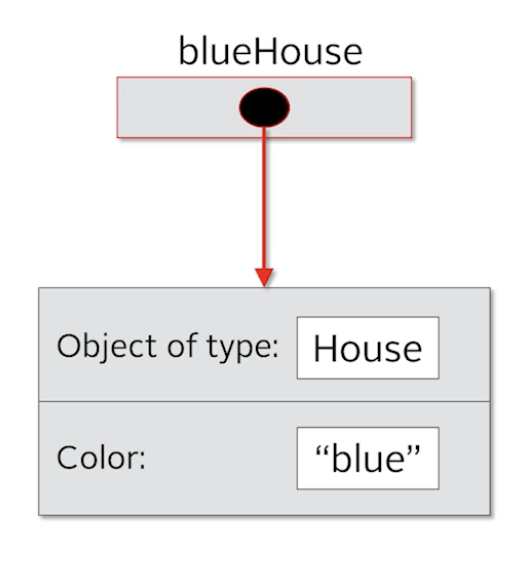
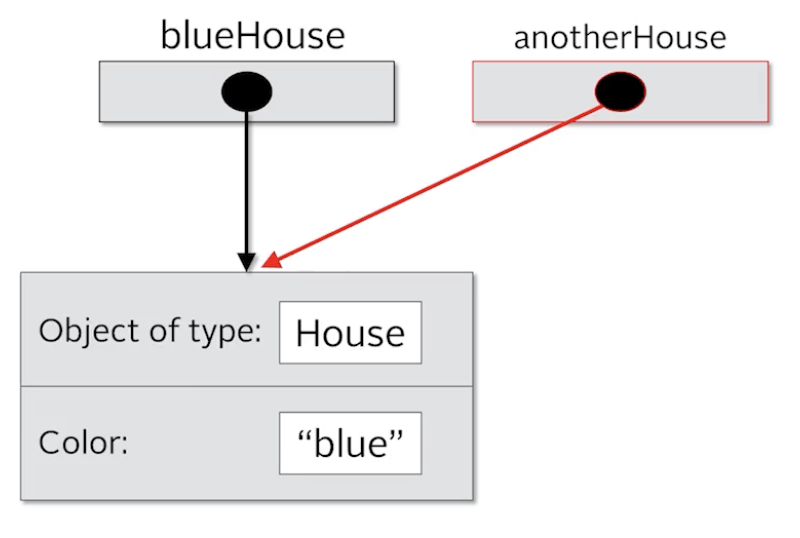
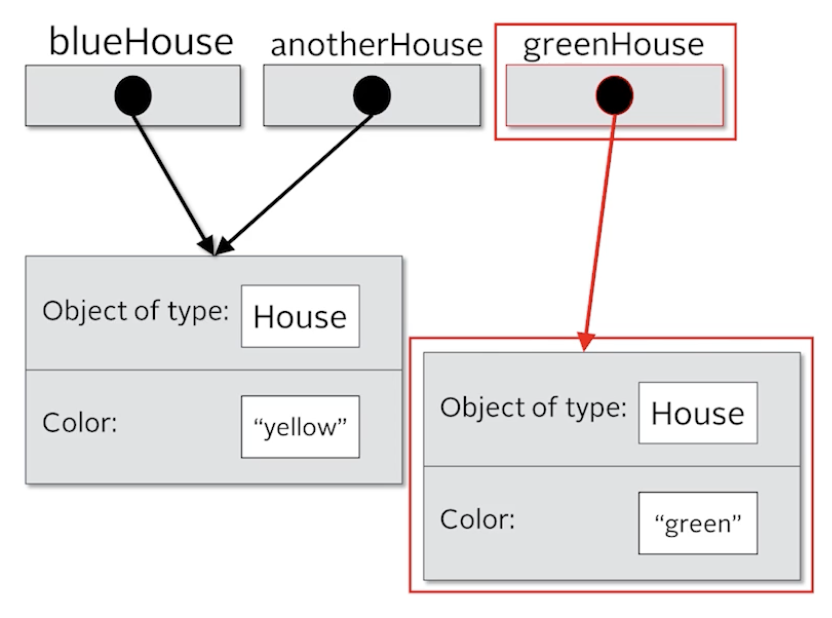
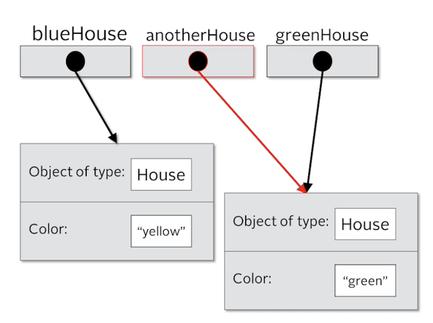

# Section 07 - OOP Classes & Inheritance

- OOP: Object Oriented Programming is a way to model real world objects, as software objects, which contain both data and code

## Deep dive into Classes and Objects

- Class based Programming starts with classes which is a blueprint of objects
- Object store it's state in fields called variables
- The class describes the data (field) and the behaviour (methods)
- A class member can be a field, a method or any other dependent element

### Static and instance

- If a field is static, there is only one copy in the memory and the value is associated with the class, or template itself
- If a field is non-static, its called an instance field, and each object may have a different value stored for this field.
- Static methods cannot be dependent on any object's state so it can't reference any instance members.
- In other words any methods that operate on instance fields, needs to be non-static

### Coding

- Class can be created by riight clicking the `src` folder > New > Class. Followed by naming it

```java
public class Car {

}
```

- The `public` keyword is the access modifier defining what access others will have to this class

### Organizing classes

- Classes can be organized into logical groupings which are called packages.
- You declare a package name in the class using the package statement.
- If you don't declare a package, the class implicitly belongs to the default package.

### Access modifiers for the class

- A class is said to be a top-level class if it is defined in the source code file and not enclosed in the code block of another class, type, or method.
- A top-level class has only two valid access modifier options: public or none.

| Access keyword | Description                                                                                                                                         |
| -------------- | --------------------------------------------------------------------------------------------------------------------------------------------------- |
| public         | public means any other class in any package can access this class.                                                                                  |
|                | When the modifier is omitted, this has special meaning, called package access, meaning the class is accessible only to classes in the same package. |

- Local Variables:
  - Variables till now were inside a method or code block.
  - These were local variables belonged to the method or the code block.
  - We cannot access those variables outside the method or the block we declared them in.
- Class Variables:
  - Classes lets us declare variables that can be seen or acessible by any code block within the class.
  - But we can also allow access from outside the class.
  - When we are designing the class, there are some things we want the public to know and some things which are not nessesary for the public to know.
  - This can be handled by specifying various access modifiers for each member of the class

### Access modifiers for class members

- An access modifier at the member level allows granular control over class members.
- The valid access modifiers are shown in this table from the least restrictive to the most restrictive.

| Access keyword | Description                                                                                                                                         |
| -------------- | --------------------------------------------------------------------------------------------------------------------------------------------------- |
| public         | public means any other class in any package can access this class.                                                                                  |
| protected      | protected allows classes in the same package, and any subclasses in other packages, to have access to the member.                                   |
|                | When the modifier is omitted, this has special meaning, called package access, meaning the member is accessible only to classes in the same package |
| private        | private means that no other class can access this member                                                                                            |

### Encapsulation

- Mostly, we make the members private. This is called encapsulation - A key fundamental rule for Object Oriented Programming
- Encapsulation in Object-Oriented Programming usually has two meanings:
  - One is the bundling of behavior and attributes on a single object.
  - The other is the practice of hiding fields and some methods from public access. (mostly this meaning is used)
- When we make the attributes private, we can then make methods to access the data, each with different degrees of access allowed as needed.

### Fields of a class

```java
public class Car {

    //    these are fields of the class
    private String make;
    private String model;
    private String color;
    private int doors;
    private boolean convertible;
}
```

- These are the fields of the class as they are defined in the body of the class and not inside any method.
- When we create a object of this class, then the values are assigned to these fields representing the state of the object.
- Unlike local variables, class variables should have some kind of access modifiers tied to it.
- If we don't declare a access modifier, Java declares the default one (package-private), implicitly.
- We are not assigning any values to these variables, as it's likely would be different for each instance of the class.

### Methods in a class

- Methods are often public, unlike fields as we want the user to interact with the class with these methods

```java
public class Car {

    //    these are fields of the class
    private String make;
    private String model;
    private String color;
    private int doors;
    private boolean convertible;

    public void describeCar() {
        System.out.println(doors + "-door" +
                color + " " +
                make + " " +
                model +
                (convertible ? " (convertible)" : "")
        );
    }
}
```

## Getters, Setters, Encapsulation, and Object Access

### Instance of a class

- To create an instance of a class, we simply use the `new` keyword

```java
public class Main {
    public static void main(String[] args) {
        Car car = new Car();
        car.describeCar();
    }
}
```

Output:

```sh
0-door null null null
```

### What is null?

- null is a special keyword in Java, meaning, the variable or attribute has a type but no reference to an object.
- This means that no instance or object is assigned to the variable or field.
- Fields with primitive data types are never null.

### Default values for fields on classes

- Fields on classes are assigned default values automatically by Java, if you don't assign values yourself.

<table border="1" cellspacing="0" cellpadding="8">
  <tr>
    <th>Data type</th>
    <th>Default value assigned</th>
  </tr>
  <tr>
    <td>boolean</td>
    <td>false</td>
  </tr>
  <tr>
    <td>byte</td>
    <td rowspan="5" align="center">0</td>
  </tr>
  <tr>
    <td>short</td>
  </tr>
  <tr>
    <td>int</td>
  </tr>
  <tr>
    <td>long</td>
  </tr>
  <tr>
    <td>char</td>
  </tr>
  <tr>
    <td>double</td>
    <td rowspan="2" align="center">0.0</td>
  </tr>
  <tr>
    <td>float</td>
  </tr>
</table>

- We can also add our own default values

```java
public class Car {

    //    these are fields of the class
    private String make = "Tesla";
    private String model = "Model X";
    private String color = "Gray";
    private int doors = 2;
    private boolean convertible = true;

    public void describeCar() {
        System.out.println(doors + "-door " +
                color + " " +
                make + " " +
                model +
                (convertible ? " (convertible)" : "")
        );
    }
}
```

> The private fields cannot be access outside the class anywhere!

### Getters and Setters

- A getter is a method on a class that retrieves the value of a private field and returns it.
- A setter is a method on a class that sets the value of a private field.
- The purpose of these methods is to control and protect access to private fields.
- The getter and setter signatures are part of the class's public interface but the fields and the types aren't
  - This means that we can change things internally like the name or type of the field, but as long as we use the same getter and setter methods, these changes should have no effect of external code that uses our class. Our internal chnages are hidden from the users.

#### Getter:

- A getter method usually returns the value of a private field.
- It's usual to name a getter name with the "get" prefix followed by the name of the field (in camel case)
- We can have getter methods for that are not really declared in our class but are derived in some way

```java
public String getMake() {
    return make;
}
```

- IntelliJ has an option to automatically generate the getters. From the right click content menu, select Generate

<table>
  <tr>
    <td></td>
    <td></td>
    <td></td>
  </tr>
</table>

- Select on one or more fields to generate the getters

> [!NOTE]
>
> ```java
> public boolean isConvertible() {
>     return convertible;
> }
> ```
>
> For boolean fields the "is" prefix is used

#### Setter:

- A setter method may simply assign the argument passed to the method to the field.
- It can contain code to validate data, check additional security requirements, ensure immutability of the field value or any other code required to protect and validate an object's state.
- It's usual to name a setter methid with a "set" prefix followed by the name of the field (in camel case)
- There might be a case where we wont need a setter method for a private field because maybe it's data only needed within the class itself and doesn't need to be exposed to the outer world.
- Setter methods doesn't return anything, so they are void
- Settings can be gnerated through IntelliJ same as getters

<table>
<tr>
<td>

```java
public void setMake(String make) {
    make = make;
    // here there is an ambiguity with the
    // field name and the parameter name
    // of the method
}
```

</td>
<td>

```java
public void setMake(String make) {
    this.make = make;
    // this keyword is used to solve the ambiguity
}
```

</td>
</tr>
</table>

- Various validations can be done with the setters

```java
public void setMake(String make) {
    if(make == null) make = "Unknown";
    String lowercaseMake = make.toLowerCase();
    switch (lowercaseMake) {
        case "holden", "porsche", "tesla" -> this.make = make;
        default -> {
            this.make = "Unsupported";
        }
    }
}
```

### `this`

- `this` is a special keyword in Java.
- What it really refers to is the instance that was created when the object was instantiated.
- So, `this` is a special reference name for the object or instance, which it can use to describe itself.
- And we can use `this` to access fields on the class.
- `this` keyword is optional and can be used to fix ambiguity. It's usability sometimes depends on readability. Idealy it's preferable to use `this` to remove any confusion that it's refering to a field of the class

### Uninitialized variables

- This would cause an error as we didn't initialized the variable with the `new` keyword

```java
Car car;
car.setMake("Porsche");
```

> Compilation Error: `java: variable car might not have been initialized`

- But if we set the variable to `null`, it wont throw a compilation error, but a runtime error (Exception). This means we have defined a variable of `Car` but it doen't have a reference to a valid instance of a `Car`, so we cant run a method on `null`

```java
Car car = null;
car.setMake("Porsche");
```

> Runtime Error: `Cannot invoke "Car.setMake(String)" because "car" is null`

- So, an uninitialized variables causes a compile time error, but a variable with a null reference can be used in the code without a compiler error but it'll throw an exception in the runtime. So, when creating objects, we should ideally use the `new` keyword followed the name of the class and optionally any arguments.

## Constructors - Object initialization

- A constructor is used in the creation of an object.
- It is a special type of code block that has a specific name and parameters, much like a method.
- It has the same name as the class itself, and it doesn't return any values.
- You never include a return type from a constructor, not even void.
- You can, and should, specify an appropriate access modifier to control who should be able to create new instances of the class, using this constructor.

```java
public class Account { // This is the class declaration
  public Account() { // This is the constructor declaration
    // Constructor code is code to be executed as the object is created.
  }
}
```

- Constructor can be used to set the values of fields in your instance along with other initialization code you want to perform.
- A constructor is created implicitly by Java

> By implicit in java, it means that we dont see that in the code, but its present in the bytecode that gets generated during the compilation process

- When we use the `new Account()`, it actually calls the implicit constructor, as we didn't explicitly create a constructor in the first place. This is called the default construcot

> Default Constructor
>
> - If a class contains no constructor declarations, then a default constructor is implicitly declared.
> - This constructor has no parameters and is often called the no-args (no arguments) constructor.
> - If a class contains any other constructor declarations, then a default constructor is NOT implicitly declared.

- The purpose of the constructor is to initialize the object that we are creating and do whatever else i need to do while instantiating.
- It's only called once when we are creating the object
- A class can have one or many constructors one of which can be a no-args constructor

```java
// no-agrs constructor
public BankAccount() {
      System.out.println("Empty constructor called");
}

// args constructor
public BankAccount(String accountNumber, float accountBalance, String customerName, String email, String phoneNumber) {
    System.out.println("BankAccount Constructor with parameters called");
    this.accountNumber = accountNumber;
    this.accountBalance = accountBalance;
    this.customerName = customerName;
    this.email = email;
    this.phoneNumber = phoneNumber;
}
```

- Having multiple constructors is called constructor overloading

### Constructor Overloading

- Constructor overloading is declaring multiple constructors with different parameters.
- The number of parameters can be different between constructors.
- Or if the number of parameters is the same between two constructors, their types, or order of types must differ.

## Constructors - Overloading and Chaining

- Constructor chaining is when one constructor explicitly calls another overloaded constructor.
- You can only use constructor chaining, within constructors.
- You must use the special statement `this()` to execute another constructor, passing it arguments if required.
- And `this()` must be the first executable statement if it's used from another constructor.

```java
public BankAccount() {
    // chaining - must be first line
    this("696969696969", 10, "Default Name", "Default Email", "Default Phone");
    System.out.println("Empty constructor called");
}

public BankAccount(String accountNumber, float accountBalance, String customerName, String email, String phoneNumber) {
    System.out.println("BankAccount Constructor with parameters called");
    this.accountNumber = accountNumber;
    this.accountBalance = accountBalance;
    this.customerName = customerName;
    this.email = email;
    this.phoneNumber = phoneNumber;
}
```

> It's better to assign the values directly in the constructor rather than using the setters in the constructor. It's a general rule of thumb.

> IntelliJ has an option to auto-generate the constructors similar to getters and setters. We can choose the fields we want as parameters in the dialog box too.

- It's a general pattern where we create one major constructor which initialized all the fields and our other overloaded constructors can call the major one (through the concept of chaining) with some hard-ceded default values for the missing fields

```java
public BankAccount(String customerName, String email, String phoneNumber) {
    this("999999999", 10, customerName, email, phoneNumber);
}
```

## Reference vs Object vs Instance vs Class

> House Analogy from the Physical World 🌏
>
> - A class is basically a blueprint for the house.
> - Using the blueprint, we can build as many houses as we like based on those plans.
> - Each house we build in other words, going back to programming terms, each house we instantiate using the new operator is an object.
> - This object can also be known as an instance. Often, we'll say it's an instance of the class.
> - So, we would have an instance of house in this example.
> - Getting back to the physical world, each house we build has an address (it's built at a physical location).
> - In other words, if we want to tell someone where we live, we give them our address (perhaps written on a piece of paper). This is known as a reference.
> - We can copy that reference as many times as we like, but there is still just one house that we're referring to.
> - In other words, we're copying the paper that has the address on it, not the house itself.
> - We can pass references as parameters to constructors and methods.

```java
public class House {

    private String color;

    public House(String color) {
        this.color = color;
    }

    public String getColor() {
        return color;
    }

    public void setColor(String color) {
        this.color = color;
    }
}
```

```java
public class Main {

    public static void main(String[] args) {

        House blueHouse = new House("blue");
        House anotherHouse = blueHouse;

        System.out.println(blueHouse.getColor()); // prints blue
        System.out.println(anotherHouse.getColor());// blue

        anotherHouse.setColor("red");
        System.out.println(blueHouse.getColor()); // red
        System.out.println(anotherHouse.getColor());// red

        House greenHouse = new House("green");
        anotherHouse = greenHouse;

        System.out.println(blueHouse.getColor()); //red
        System.out.println(greenHouse.getColor()); // green
        System.out.println(anotherHouse.getColor());// green
    }
}
```

|                                                                                                                                                    |                                                                                                                                         |
| ------------------------------------------------------------------------------------------------------------------------------------------------------------------- | -------------------------------------------------------------------------------------------------------------------------------------------------------- |
| `House blueHouse = new House("blue)`                                                                                                                                | `House anotherHouse = blueHouse`                                                                                                                         |
| `House` is a blueprint and we are creating a new instance of `House` and assigning that to the variable `blueHouse` (It is a reference to the object in the memory) | It creates another reference to the same object in the memory. There is still one `House` object but we have two references pointing to the same object. |
| `blueHouse.getColor()` will be `blue`                                                                                                                               | `anotherHouse.getColor()` will be `blue` as it's a reference to the same object `blueHouse`                                                              |
| `anotherHouse.setColor("red")`                                                                                                                                      | `<-----`                                                                                                                                                 |
| `blueHouse.getColor()` now will be `yellow` as `anotherHouse` changed the value in the same reference to the memory                                                 | `blueHouse.getColor()` will be `yellow`                                                                                                                  |

|                         |                        |
| ---------------------------------------- | --------------------------------------- |
| `House greenHouse = new House("green");` | `anotherHouse = greenHouse;`            |
| A completely new object in the memory    | Reference of `anotherHouse` changed now |

> In Java, we always have an reference to an object in memory. There's no way to access an object directly. Everything is done through the reference.

### The reference vs The object

```java
new House("red");
```

- Here the code compiles fine, the object is created in the memory but after this statement, there is no way our code can access this object
- The object exists in the memory, but I can't communicate with it after the statement has executed.
- This is because we didn't create a reference to it.
- It'll stay in memory until Java's automatic garbage collection process figures out there's no running code with a reference to this object and deletes it.
- In fact this object is eligible for garbage collection as soon as this line is executed.

```java
House myHouse = new House("beige");
```

- Here the reference variable has access to the object in memory as long as the variable stays in scope and/or gets reassigned to a different reference.

```java
House redHouse = new House("red");
```

- This is a totally new object in memory, and different from the last red house we created.
