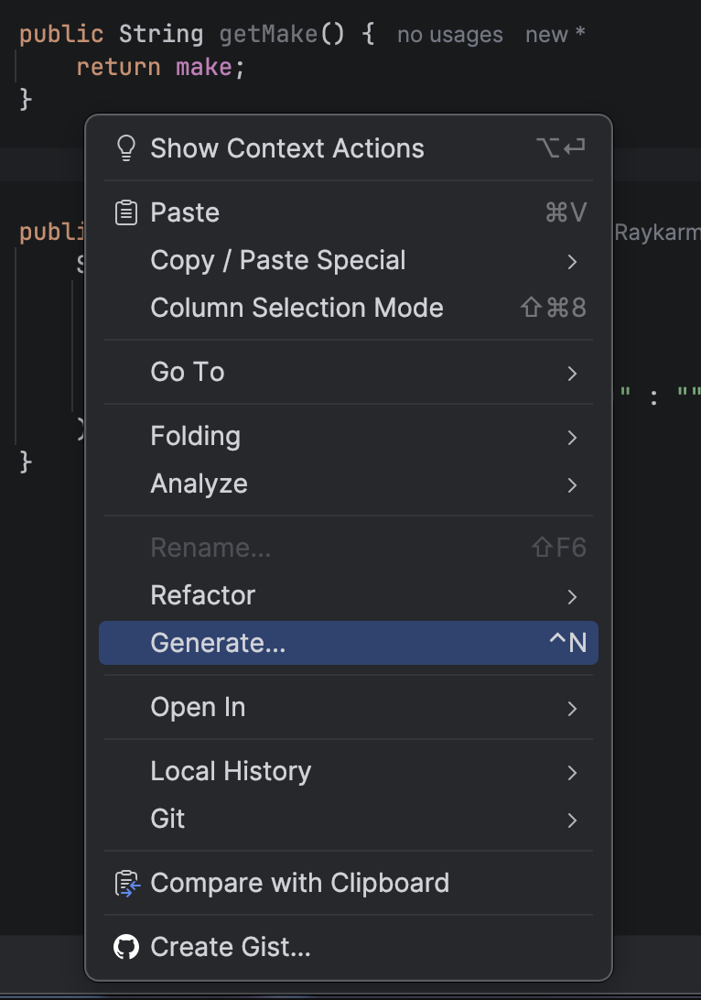
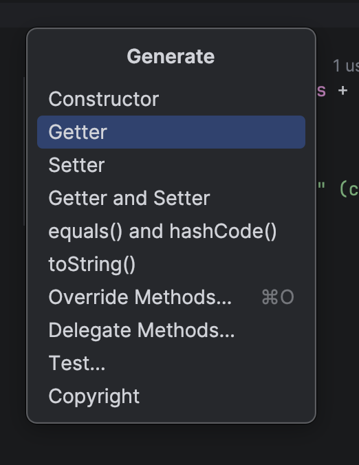
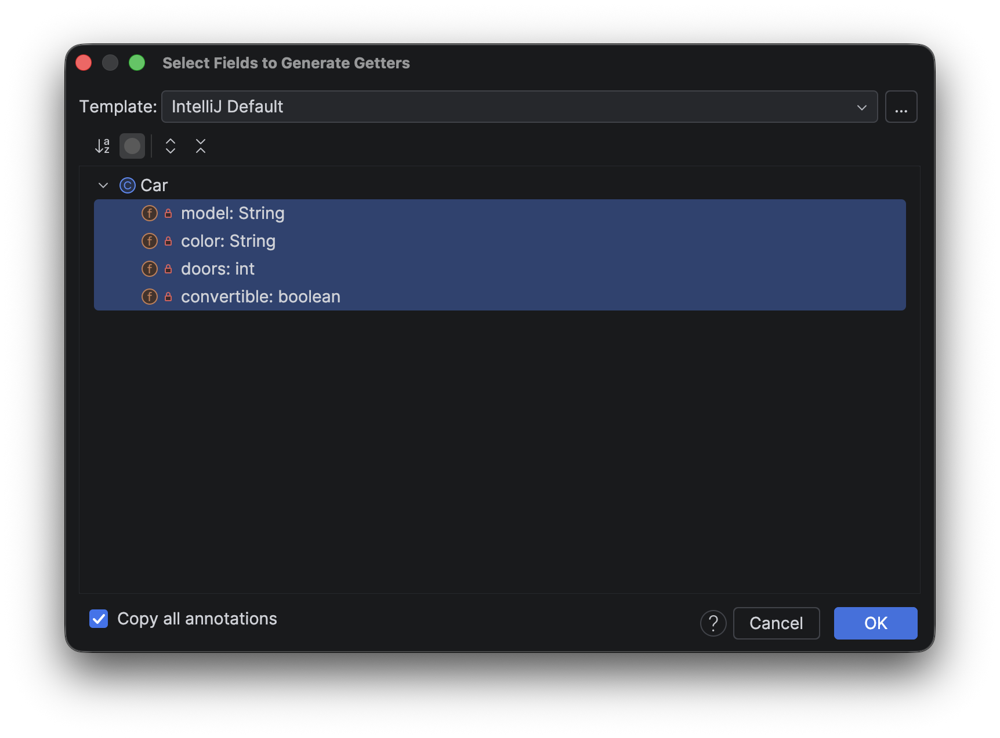

# Section 07 - OOP Classes & Inheritance

- OOP: Object Oriented Programming is a way to model real world objects, as software objects, which contain both data and code

## Deep dive into Classes and Objects

- Class based Programming starts with classes which is a blueprint of objects
- Object store it's state in fields called variables
- The class describes the data (field) and the behaviour (methods)
- A class member can be a field, a method or any other dependent element

### Static and instance

- If a field is static, there is only one copy in the memory and the value is associated with the class, or template itself
- If a field is non-static, its called an instance field, and each object may have a different value stored for this field.
- Static methods cannot be dependent on any object's state so it can't reference any instance members.
- In other words any methods that operate on instance fields, needs to be non-static

### Coding

- Class can be created by riight clicking the `src` folder > New > Class. Followed by naming it

```java
public class Car {

}
```

- The `public` keyword is the access modifier defining what access others will have to this class

### Organizing classes

- Classes can be organized into logical groupings which are called packages.
- You declare a package name in the class using the package statement.
- If you don't declare a package, the class implicitly belongs to the default package.

### Access modifiers for the class

- A class is said to be a top-level class if it is defined in the source code file and not enclosed in the code block of another class, type, or method.
- A top-level class has only two valid access modifier options: public or none.

| Access keyword | Description                                                                                                                                         |
| -------------- | --------------------------------------------------------------------------------------------------------------------------------------------------- |
| public         | public means any other class in any package can access this class.                                                                                  |
|                | When the modifier is omitted, this has special meaning, called package access, meaning the class is accessible only to classes in the same package. |

- Local Variables:
  - Variables till now were inside a method or code block.
  - These were local variables belonged to the method or the code block.
  - We cannot access those variables outside the method or the block we declared them in.
- Class Variables:
  - Classes lets us declare variables that can be seen or acessible by any code block within the class.
  - But we can also allow access from outside the class.
  - When we are designing the class, there are some things we want the public to know and some things which are not nessesary for the public to know.
  - This can be handled by specifying various access modifiers for each member of the class

### Access modifiers for class members

- An access modifier at the member level allows granular control over class members.
- The valid access modifiers are shown in this table from the least restrictive to the most restrictive.

| Access keyword | Description                                                                                                                                         |
| -------------- | --------------------------------------------------------------------------------------------------------------------------------------------------- |
| public         | public means any other class in any package can access this class.                                                                                  |
| protected      | protected allows classes in the same package, and any subclasses in other packages, to have access to the member.                                   |
|                | When the modifier is omitted, this has special meaning, called package access, meaning the member is accessible only to classes in the same package |
| private        | private means that no other class can access this member                                                                                            |

### Encapsulation

- Mostly, we make the members private. This is called encapsulation - A key fundamental rule for Object Oriented Programming
- Encapsulation in Object-Oriented Programming usually has two meanings:
  - One is the bundling of behavior and attributes on a single object.
  - The other is the practice of hiding fields and some methods from public access. (mostly this meaning is used)
- When we make the attributes private, we can then make methods to access the data, each with different degrees of access allowed as needed.

### Fields of a class

```java
public class Car {

    //    these are fields of the class
    private String make;
    private String model;
    private String color;
    private int doors;
    private boolean convertible;
}
```

- These are the fields of the class as they are defined in the body of the class and not inside any method.
- When we create a object of this class, then the values are assigned to these fields representing the state of the object.
- Unlike local variables, class variables should have some kind of access modifiers tied to it.
- If we don't declare a access modifier, Java declares the default one (package-private), implicitly.
- We are not assigning any values to these variables, as it's likely would be different for each instance of the class.

### Methods in a class

- Methods are often public, unlike fields as we want the user to interact with the class with these methods

```java
public class Car {

    //    these are fields of the class
    private String make;
    private String model;
    private String color;
    private int doors;
    private boolean convertible;

    public void describeCar() {
        System.out.println(doors + "-door" +
                color + " " +
                make + " " +
                model +
                (convertible ? " (convertible)" : "")
        );
    }
}
```

## Getters, Encapsulation, and Object Access

### Instance of a class

- To create an instance of a class, we simply use the `new` keyword

```java
public class Main {
    public static void main(String[] args) {
        Car car = new Car();
        car.describeCar();
    }
}
```

Output:

```sh
0-door null null null
```

### What is null?

- null is a special keyword in Java, meaning, the variable or attribute has a type but no reference to an object.
- This means that no instance or object is assigned to the variable or field.
- Fields with primitive data types are never null.

### Default values for fields on classes

- Fields on classes are assigned default values automatically by Java, if you don't assign values yourself.

<table border="1" cellspacing="0" cellpadding="8">
  <tr>
    <th>Data type</th>
    <th>Default value assigned</th>
  </tr>
  <tr>
    <td>boolean</td>
    <td>false</td>
  </tr>
  <tr>
    <td>byte</td>
    <td rowspan="5" align="center">0</td>
  </tr>
  <tr>
    <td>short</td>
  </tr>
  <tr>
    <td>int</td>
  </tr>
  <tr>
    <td>long</td>
  </tr>
  <tr>
    <td>char</td>
  </tr>
  <tr>
    <td>double</td>
    <td rowspan="2" align="center">0.0</td>
  </tr>
  <tr>
    <td>float</td>
  </tr>
</table>

- We can also add our own default values

```java
public class Car {

    //    these are fields of the class
    private String make = "Tesla";
    private String model = "Model X";
    private String color = "Gray";
    private int doors = 2;
    private boolean convertible = true;

    public void describeCar() {
        System.out.println(doors + "-door " +
                color + " " +
                make + " " +
                model +
                (convertible ? " (convertible)" : "")
        );
    }
}
```

> The private fields cannot be access outside the class anywhere!

### Getters and Setters

- A getter is a method on a class that retrieves the value of a private field and returns it.
- A setter is a method on a class that sets the value of a private field.
- The purpose of these methods is to control and protect access to private fields.
- The getter and setter signatures are part of the class's public interface but the fields and the types aren't
  - This means that we can change things internally like the name or type of the field, but as long as we use the same getter and setter methods, these changes should have no effect of external code that uses our class. Our internal chnages are hidden from the users.

#### Getter:

- A getter method usually returns the value of a private field.
- It's usual to name a getter name with the "get" prefix followed by the name of the field (in camel case)
- We can have getter methods for that are not really declared in our class but are derived in some way

```java
public String getMake() {
    return make;
}
```

- IntelliJ has an option to automatically generate the getters. From the right click content menu, select Generate

<table>
  <tr>
    <td></td>
    <td></td>
    <td></td>
  </tr>
</table>

- Select on one or more fields to generate the getters

> [!NOTE]
>
> ```java
> public boolean isConvertible() {
>     return convertible;
> }
> ```
>
> For boolean fields the "is" prefix is used

#### Setter:

- A setter method may simply assign the argument passed to the method to the field.
- It can contain code to validate data, check additional security requirements, ensure immutability of the field value or any other code required to protect and validate an object's state.
- It's usual to name a setter methid with a "set" prefix followed by the name of the field (in camel case)
- There might be a case where we wont need a setter method for a private field because maybe it's data only needed within the class itself and doesn't need to be exposed to the outer world.
